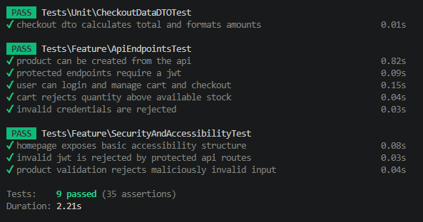
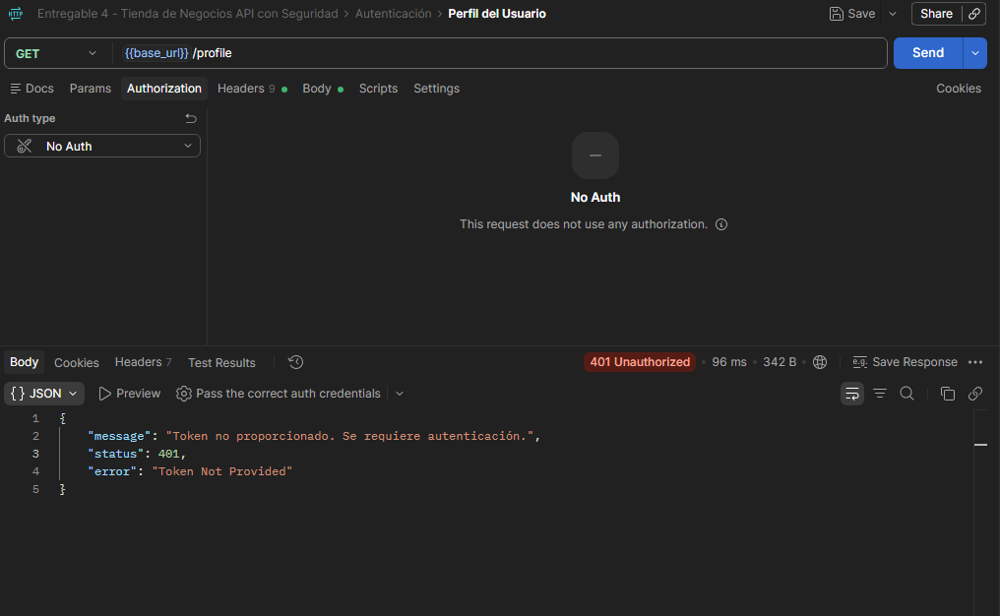
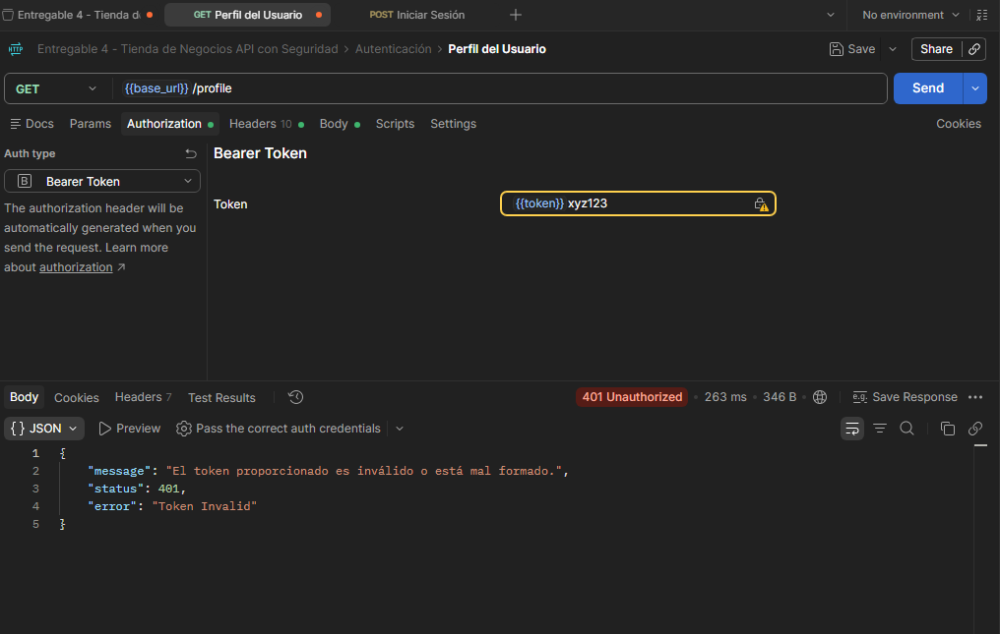
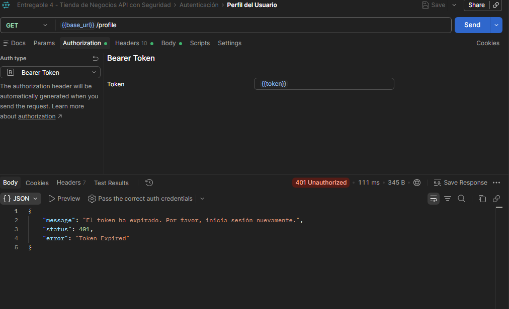
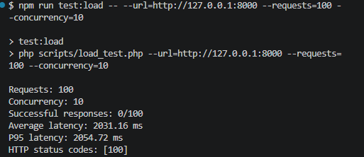

# Tienda de Negocios - Entrega 5
## Calidad y Robustez de la API mediante PHPUnit, Factories, Seeders y Mocking

¡Proyecto correspondiente a la quinta y última entrega, garantizando la calidad, robustez y seguridad de la tienda en línea mediante una suite completa de pruebas unitarias y de integración con PHPUnit, generación de datos con Factories/Seeders, simulación de dependencias con Mocking y despliegue final!

---

### 🎯 1. Objetivo del Trabajo
Garantizar la calidad y robustez de la Tienda de Negocios mediante pruebas unitarias y de integración con PHPUnit, incluyendo Feature Tests sobre los endpoints de la API y generación de datos de prueba con Factories y Seeders.

---

### 🧱 2. Arquitectura de la Suite de Pruebas y el Proyecto

* `app/Models:` Entidades Eloquent y relaciones de negocio.

* `app/Http/Controllers/Api:` Endpoints REST de catálogo, autenticación, carrito y checkout.

* `app/Contracts y app/Services:` Contratos e implementaciones (incluyendo servicios de pago simulados).

* `database/factories y database/seeders:` Datos reproducibles para desarrollo y entornos de testing (User, Categoria, Producto).

* `tests/Unit:` Pruebas aisladas sobre lógica de negocio, cálculos financieros (CheckoutDataDTO) y validaciones de modelos.

* `tests/Feature:` Pruebas de integración de punta a punta sobre los flujos HTTP de la API y validaciones de seguridad.

---

### 🚀 3. Instrucciones de Instalación y Configuración Local

Para poner en marcha el proyecto en tu entorno local:

1. **Requisitos previos**
 Tener instalado PHP (versión recomendada 8.4+), Composer y una base de datos compatible (como MySQL o SQLite).

2. **Instalar dependencias**
 Ejecuta en la terminal en la raíz del proyecto:
 
 ```Bash
 composer install
 ```

3. **Configurar el entorno y las claves de seguridad**
 Copia el archivo de ejemplo de variables de entorno y genera las llaves de encriptación de la aplicación y del sistema JWT:

 ```Bash
 cp .env.example .env
 ```
 ```Bash
 php artisan key:generate
 ```
 ```Bash
 php artisan jwt:secret
 ```

4. **Ejecutar las migraciones y seeders**
 ```Bash
 php artisan migrate --seed
 ```

5. **Iniciar el servidor de desarrollo**
 ```Bash
 php artisan serve
 ```
 El servidor estará disponible en `http://127.0.0.1:8000`.

---

### 🧪 4. Configuración y Ejecución de PHPUnit
PHPUnit se encuentra configurado en el núcleo del proyecto para ejecutar pruebas aisladas utilizando una base de datos SQLite en memoria (definido en phpunit.xml), evitando alterar la base de datos local de desarrollo.

* Para ejecutar toda la suite de pruebas de forma limpia, utiliza:

```Bash
php artisan test
```
* Si deseas ejecutar las pruebas por separado, puedes utilizar:

```Bash
php artisan test --testsuite=Unit
```
```Bash
php artisan test --testsuite=Feature
```

* **Salida de Ejecución de PHPUnit (Evidencia de Pruebas Exitosas)**


---

### 🗂️ 5. Pruebas Unitarias y Feature Tests Implementados
La cobertura de pruebas automatizadas abarca de forma rigurosa los requerimientos del sistema:

* `Pruebas Unitarias:` Validación del cálculo financiero de subtotales, impuestos, envíos y totales mediante DTOs, además de la lógica de los modelos y normalización de atributos.

* `Feature Tests de Punta a Punta:` Cobertura de los endpoints principales de la API:

1. Alta y persistencia de productos en la base de datos.

2. Flujo completo de autenticación con JWT (/api/login, emisión y validación de tokens).

3. Gestión del carrito de compras (agregar, modificar, eliminar ítems y restricciones de stock máximo).

4. Proceso de checkout, cálculo de totales, descuento de inventario y vaciado del carrito.

* `Validación de Middlewares de Seguridad:` Comprobación automatizada de que las rutas protegidas devuelven un código HTTP 401 Unauthorized al intentar acceder sin un JWT válido, con tokens alterados o con tokens expirados.

Aqui los ejemplos visuales de los middlewares de seguridad en acción:

1. **Sin Token:**


2. **Token Inválido:**


3. **Token Expirado:**


---

### 🧩 6. Factories, Seeders y Mocking de Dependencias Externas

* `Factories y Seeders:` Se configuraron UserFactory, CategoriaFactory y ProductFactory junto a sus respectivos seeders (CategoriaSeeder, ProductoSeeder) para poblar de forma dinámica y consistente los datos de prueba requeridos tanto para el desarrollo como para el entorno de testing mediante RefreshDatabase.

* `Mocking de Dependencias:` El proceso de checkout utiliza el contrato App\Contracts\PaymentGateway. Para evitar llamadas a pasarelas de pago reales durante las pruebas, la suite utiliza Mocking ($this->mock()) en ApiEndpointsTest.php para interceptar el método charge(), verificando que reciba el total y el método de pago esperados de manera totalmente aislada y segura.

---

### 🎁 7. Bonus Opcional: Pruebas de Rendimiento, Accesibilidad y Penetración

**Pruebas de Carga y Rendimiento**
El script scripts/load_test.php permite evaluar solicitudes concurrentes contra los endpoints públicos para medir respuestas exitosas, latencia y códigos HTTP de forma controlada mediante. Asegurate en ejecutarlo en Git Bash para que funcione correctamente:

```Bash
npm run test:load -- --url=http://127.0.0.1:8000 --requests=100 --concurrency=10
```

- Deberá de verse tal que asi:



**Pruebas de Accesibilidad y Penetración Básica**
Implementadas en tests/Feature/SecurityAndAccessibilityTest.php, verificando la correcta estructuración de respuestas, rechazo de payloads maliciosos con etiquetas <script> y validación estricta de entradas numéricas negativas.

---

### 🌐 8. Despliegue en Producción
La aplicación se encuentra lista y desplegada para su acceso en línea:

* `URL de Producción:` [Pendiente de despliegue oficial / URL pública de producción]

---

### 🛸 9. Autor del Trabajo
- **Nombre y Apellido:** Agustina Martinez Godoy
- **Email:** martinezgodoyagustin@gmail.com

> ¡Disfrute del código!